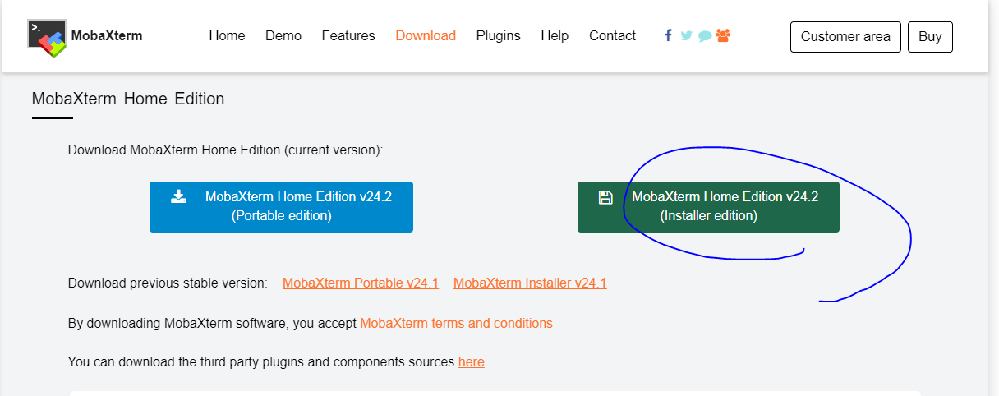

## [번외] MobaXterm을 활용한 SSH 접속

Windows 환경에서 리눅스 서버에 접속할 때 널리 사용하는 도구인 **MobaXterm**의 설치 및 사용 방법을 안내합니다.

---

### 1. MobaXterm 다운로드

- [https://mobaxterm.mobatek.net/download-home-edition.html](https://mobaxterm.mobatek.net/download-home-edition.html)

---

### 2. 압축 해제

- 다운로드한 파일을 압축 해제합니다.

---

### 3. 세션 생성

- 프로그램 실행 후 상단 메뉴에서 `Session` 버튼 클릭

---

### 4. SSH 세션 선택

- 접속 방식 중 `SSH` 선택

---

### 5. 접속 정보 입력

- **Remote host**: 서버 IP 입력  
- **Specify username**: 사용자 계정 입력  
- **Port**: 접속 포트 입력

---

### 6. 접속 및 키 수락

- 최초 접속 시 서버 키를 묻는 창이 나타나며, **Accept**를 클릭하여 접속

---

### 요약

1. MobaXterm을 설치하고 실행한다.
2. 세션을 생성하고 SSH 방식을 선택한다.
3. 접속할 서버의 IP, 사용자명, 포트를 입력한다.
4. 처음 접속 시 보안 키를 수락하고 접속을 완료한다.