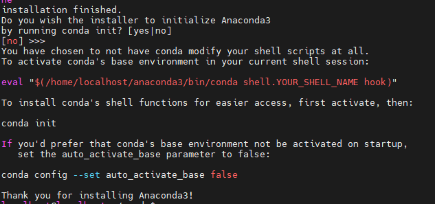

# [번외] 아나콘다

* 개인 학습/연구용도: 무료
* 기업 내 비상업적 사용: 제한적 허용
* 기업 환경에서의 협업/제품 개발: 유료 라이선스 필요
* 팀 사용, 배포 목적: Anaconda Team Edition 이상 필요

[→ 라이센스(공식)](https://www.anaconda.com/licensing)
[→ 블로그](https://www.whatwant.com/entry/miniconda)

## 아나콘다 설치

### 1. 설치 파일 실행

```bash
$ bash Anaconda3-2023.03-Linux-x86_64.sh
```

* 설치 중에 **라이선스 동의**를 요구하는 메시지가 나온다.
* 내용 다 읽고 나서 `yes` 입력하면 설치가 진행된다.

---

### 2. 환경 변수 등록

설치가 끝나면 `conda` 명령어를 바로 쓰기 위해서 환경 변수 등록을 해야 한다.



```bash
$ echo 'eval "$(/home/seon/anaconda3/bin/conda shell.bash hook)"' >> ~/.bashrc
```

> 위 경로는 본인의 설치 위치에 맞게 수정해야 한다.

---

### 3. 설치 확인

```bash
$ conda --version
```

이 명령어를 실행했을 때 Conda 버전이 출력되면 설치 완료
