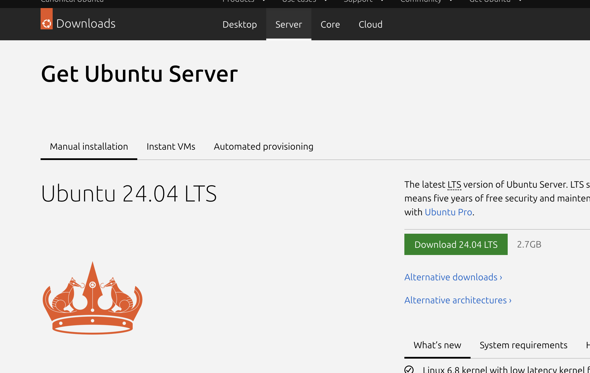

# 0. 시작하기에 앞서

## 강의 목표

이 강의가 끝난 후 여러분은 다음과 같은 역량을 갖추게 됩니다.

- 리눅스의 개념과 작동 원리를 이해하고, 간단한 명령어를 사용할 수 있다.
- vi 편집기를 활용하여 텍스트 파일을 작성 및 수정할 수 있다.
- 파일의 내용을 확인하고 필요한 정보를 추출할 수 있다.
- 외부 리눅스 서버에 접속하여 원격으로 명령을 실행할 수 있다.
- 셸(Shell)의 개념을 이해하고 간단한 셸 스크립트를 작성할 수 있다.
- 파일 권한을 설정할 수 있으며, 프로세스를 확인 및 제어할 수 있다.
- 파일을 리눅스 ↔ 로컬 PC 간 전송할 수 있다.
- Git, Conda, Docker 등 개발 도구의 기본 개념을 이해한다.

---

## 강의 자료

- Ubuntu 24.04 기준으로 교재가 작성되어있음

## 실습 준비: 파일 다운로드

### 1. Ubuntu Server 다운로드

터미널 기반 실습만 진행하므로 **Desktop 버전이 아닌 Server 버전**을 다운로드합니다.  
GUI가 없어 자원을 더 효율적으로 사용할 수 있습니다.

- Windows, Intel Mac: [https://ubuntu.com/download/server](https://ubuntu.com/download/server)
- M1 Mac (ARM): [https://ubuntu.com/download/server/arm](https://ubuntu.com/download/server/arm)

### 2. 가상 머신 설치

강의에서는 UTM을 기준으로 설명하지만, 다른 가상 머신도 사용 가능합니다.

- UTM (Mac 추천, 특히 M1): [https://mac.getutm.app/](https://mac.getutm.app/)
- VirtualBox (Windows 추천): [https://www.virtualbox.org/wiki/Downloads](https://www.virtualbox.org/wiki/Downloads)
- 기타: VMware, LSM 등
