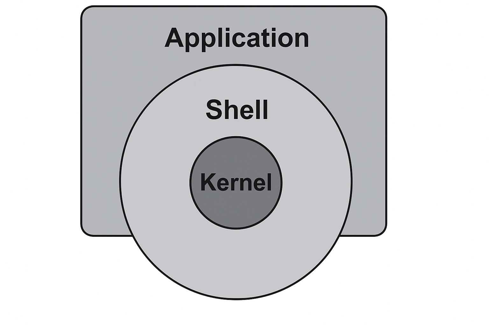

# 1. 리눅스 소개

## 1. 리눅스란?

- 리눅스는 **무료이자 오픈 소스**인 운영 체제(OS)이다.
- Unix 기반으로 설계되어 다양한 장치에서 작동할 수 있는 **유연하고 강력한 시스템**이다.
- 리눅스 커널은 **리누스 토르발스(Linus Torvalds)** 가 1991년에 처음 개발했다.

## 2. 운영 체제(OS)란?

- 하드웨어와 소프트웨어 사이의 **중개자 역할**을 하는 시스템 소프트웨어다.
- 주요 기능:
  - 하드웨어 자원(CPU, 메모리, 저장장치 등) 관리
  - 사용자 인터페이스 제공
  - 소프트웨어 실행 환경 제공

> 운영체제는 컴퓨터의 "관리자" 역할을 수행한다.  
> 예시: Windows, macOS, Android, iOS, Linux

## 3. 컴퓨터란?

- 데이터를 처리하고 저장하는 전자 장치로, **PC뿐만 아니라 스마트폰, 서버, IoT 장치 등도 컴퓨터**다.

### 컴퓨터의 구성 요소

1. **CPU (중앙처리장치)**: 컴퓨터의 핵심 처리 장치  
2. **메모리**: 데이터를 임시로 저장하며 속도가 빠름 (RAM 등)  
3. **저장 장치**: 데이터를 영구 저장 (HDD, SSD 등)  
4. **입출력 장치**: 사용자와 컴퓨터의 연결 (키보드, 모니터 등)

#### 메모리 vs 저장장치

| 항목 | 메모리 (RAM) | 디스크 (HDD, SSD) |
|------|--------------|-------------------|
| 속도 | 매우 빠름    | 느림              |
| 지속성 | 컴퓨터 종료 시 사라짐 | 종료해도 보존됨 |

## 4. 리눅스의 역사

- **1991년**: 리누스 토르발스, Minix 뉴스그룹에 무료 운영체제 포스팅  
  - [원문 링크](https://www.cs.cmu.edu/~awb/linux.history.html)
- **1992년**: GNU 프로젝트와 결합하여 완전한 자유 운영체제 구성
- **1993년~2000년대**: Debian, Slackware, RedHat, Ubuntu 등 다양한 배포판 등장
- **2008년**: Android 1.0 출시 → 리눅스 기반 모바일 운영체제 확산

### 역사적 하이라이트

| 연도 | 사건 |
|------|------|
| 1991 | 리눅스 커널 첫 공개 |
| 1993 | Debian, Slackware 등장 |
| 1994 | 리눅스 1.0 발표 |
| 2004 | Ubuntu 출시 |
| 2008 | Android 출시 (리눅스 커널 기반) |

## 5. 리눅스의 특징

- **오픈 소스**: 누구나 코드 열람·수정·배포 가능
- **무료**: 대부분 배포판은 라이센스 비용 없음
- **안정성**: 서버 환경에서 높은 안정성
- **유연성**: 다양한 하드웨어에서 작동
- **다중 사용자/다중 작업 지원**

## 6. 리눅스의 구성 요소

- **응용 프로그램**:일반 사용자가 실행하는 프로그램. 개발 도구, 편집기, 네트워크 유틸 등
- **셸(Shell)**: 사용자가 명령어를 입력하는 인터페이스 (Bash 등). 사용자의 명령어를 해석하여 커널에 전달. 
- **커널(Kernel)**: 하드웨어와 소프트웨어를 연결하는 핵심. 메모리, 파일 시스템, 프로세스, 장치 등을 관리. 운영체제의 핵심

### 관계
- 사용자는 셸에 명령을 입력하고, 셸은 이를 커널에게 전달
- 커널은 시스템 자원을 조작
- 어플리케이션은 이걸  더 쉽게 하도록 도와줌

## 7. 리눅스 배포판

- 다양한 목적과 사용자층에 맞는 **수많은 배포판** 존재

| 배포판 | 특징 |
|--------|------|
| **Ubuntu** | 초보자 친화적, 커뮤니티 활발 |
| **Debian** | 안정성 중시, 많은 배포판의 기반 |
| **CentOS** | 기업 환경, Red Hat 기반 |
| **Fedora** | 최신 기술 빠르게 반영 |
| **Arch** | 고급 사용자 대상, 커스터마이즈에 유리 |

> 오픈 소스 특성상 목적별로 다양한 버전이 존재함

### 리눅스 서버 점유율 (2025)

[리눅스 서버 점유율](https://w3techs.com/technologies/details/os-linux)

## 8. 사용 사례

- **서버 운영체제**: 웹 서버, DB 서버, 파일 서버 등
- **데스크탑**: Ubuntu 등은 일반 사용자에게도 친숙
- **임베디드 시스템**: 스마트폰(Android), IoT
- **개발 환경**: Docker, Git, Python 등과의 궁합 탁월

## 9. 장단점

### 장점

- 무료, 커스터마이즈 가능
- 높은 안정성 및 보안성
- 방대한 커뮤니티

### 단점

- 초심자에게 진입장벽 존재
- 일부 하드웨어 드라이버 부족

## 10. 리눅스의 철학

- **자유 소프트웨어 정신**: FSF, GNU 프로젝트
- **오픈 소스 개발 모델**: 글로벌 커뮤니티 협업
- **유닉스 철학**: “하나는 하나만 잘하라”

## 11. 실무에서 리눅스를 쓰는 이유 (특히 빅데이터 환경)

1. **자원 효율성**: GUI 없이 서버 리소스 집중 활용 가능  
2. **비용 효율성**: 라이선스 비용 없음  
3. **커스터마이즈 가능**: 소스 코드 수정 가능  
4. **안정성/성능**: 장시간 서비스에도 안정적  
5. **빅데이터 도구 호환성**: Hadoop, Spark 등 오픈소스 친화적  
6. **보안성**: 권한 구조, 빠른 보안 패치  
7. **커뮤니티**: 문제 해결 속도 빠름

# 요약

1. 리눅스는 컴퓨터를 제어하는 **운영 체제(OS)**다.  
2. **서버, 임베디드, 개발환경** 등 다양한 분야에서 사용된다.  
3. **무료, 커스터마이즈, 안정성** 등에서 큰 장점이 있어 기업과 개발자들에게 인기 있다.
