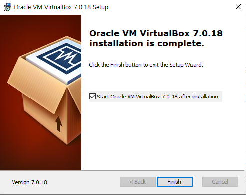
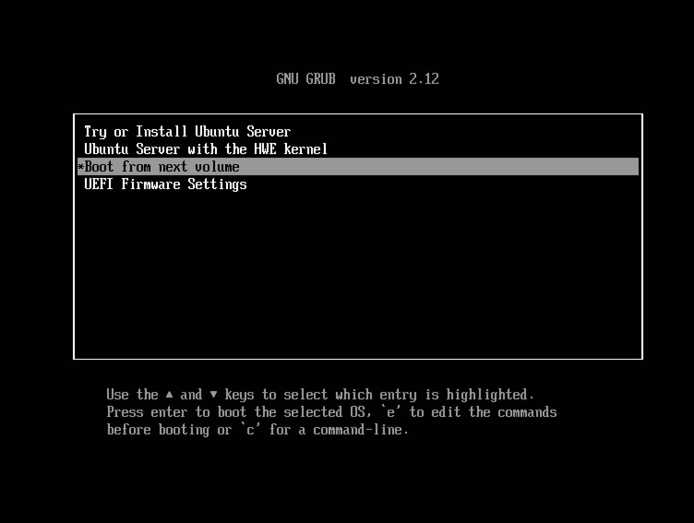

# 2. 리눅스 시작하기 (우분투)

[번외: 가상머신이란?](extra/virtual.md)


## 가상 머신 설정 및 Ubuntu 설치 실습

### 1. 가상 머신 설치

#### Windows (VirtualBox)

`VirtualBox-xxx.exe` 실행 파일을 설치한다.



#### macOS (UTM)

`UTM.dmg` 파일을 실행한다.


`UTM` 을 `Applications` 로 드래그해서 설치한다.


### 2. 가상 머신 실행

#### VirtualBox

- 상단의 `새로 만들기` 버튼 클릭  
  

- 가상 이미지 설정 (ISO 파일 지정)  
  

  - 이름: 원하는 이름
  - ISO 이미지: 다운로드한 리눅스 ISO 파일
  - 기타 설정은 기본값 유지 (메모리 낮춰도 무방)

> [번외: 자주 나오는 오류 모음](extra/troubleshooting.md)

- 키보드/마우스 "잡기" 옵션 비활성화  
  

#### UTM (Mac 전용 추천)

- "새 가상 머신 만들기" 클릭 후 **Virtualize** 선택  
  

- **Linux** 선택  
  

- ISO 이미지 업로드  
  


### 3. Ubuntu 설치 과정

- 언어 선택 → 계속 `Done` 클릭  
  

- 유저명, 서버명, 비밀번호 입력  
  

- SSH 서버 설치는 **활성화**  
  

- 설치 완료 후 재부팅 → 로그인  
  

- 로그인 완료 화면  
  

### 정상 설치가 완료되었는데 다시 설치를 요구하는 경우

- `Boot from next volume` 을 선택해본다

  


## 설치 후 첫 화면 설명

- `Ubuntu 24.04 LTS seon-server tty1`
  - 현재 Ubuntu 24.04 LTS를 사용 중
  - 호스트명은 `seon-server`
  - 현재 로그인 터미널은 `tty1`

- 기본 정보
  - System load: CPU 사용률
  - Usage of `/`: 디스크 사용률
  - Memory Usage: 메모리 사용률
  - Swap Usage: 디스크 기반 임시 메모리 사용률
  - Processes: 현재 실행 중인 프로세스 수
  - Users logged in: 로그인된 사용자 수
  - IP address (IPv4/IPv6): enp0s1 기준

- 프롬프트:
  ```shell
  seon@seon-server:~$
  ```

## [번외] 터미널
- [[번외] 터미널이란?](extra/terminal.md)


###  리눅스 설치가 계속 안 된다면
    - mac
        - mac 로컬 터미널에서 실습
    - window
        - mobaxterm 다운로드 받아서 로컬 터미널에서 실습

# 요약

1. 리눅스를 실제로 사용해보기 위해, 로컬에 가상머신을 이용해서 리눅스를 설치해보았다.