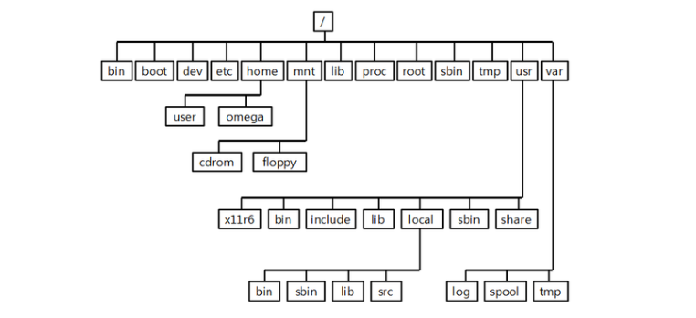

# 3. 리눅스 기본 디렉토리 구조

## 파일 시스템 계층 구조 설명



- 리눅스 파일 시스템은 루트(`/`)를 기준으로 한 **계층적 트리 구조**이다.
- 디렉터리는 하위 디렉터리로 나뉘며, 각 디렉터리에 파일이 저장된다.
- 자신을 포함하는 디렉터리를 부모 디렉터리라고 하며, `/` 디렉터리는 유일하게 부모가 없다.

## 작업 디렉터리

- 사용자가 로그인 후 셸에서 작업할 때 위치한 디렉터리를 **작업 디렉터리(현재 디렉터리)**라고 한다.
- 작업 디렉터리는 명령 실행의 기준 위치가 된다.

## 홈 디렉터리

- 사용자에게 기본적으로 할당된 디렉터리이며, 주로 `~` 로 표시된다.
- 사용자의 개인 파일과 설정 파일이 저장된다.

## 절대 경로와 상대 경로

### 절대 경로 (Absolute Path)

- 루트 디렉터리(`/`)부터 시작하여 파일이나 디렉터리까지의 전체 경로를 지정
- 항상 `/`로 시작하며, 어느 위치에서나 동일한 대상에 접근 가능  
- 예: `/home/localhost/test.txt`

### 상대 경로 (Relative Path)

- 현재 작업 디렉터리를 기준으로 상대적인 위치를 지정하는 방식
- `/`로 시작하지 않음
- 위치에 따라 달라지며, `.`(현재), `..`(상위) 등을 활용할 수 있음  
- 예: `../localhost/test.txt`

## 주요 디렉터리와 그 역할

| 디렉터리 | 설명 |
|----------|------|
| `/` | 모든 파일과 디렉터리의 최상위 루트 |
| `/bin` | 필수 명령어 저장 (`ls`, `cp`, `mv`, `rm`) |
| `/boot` | 부팅 관련 파일 및 커널 |
| `/dev` | 장치 파일 (예: `/dev/sda`) |
| `/etc` | 시스템 설정 파일 |
| `/home` | 사용자별 홈 디렉터리 |
| `/lib` | 기본 명령어 실행에 필요한 라이브러리 |
| `/media` | CD-ROM, USB 등 외부 장치 마운트 |
| `/mnt` | 임시 마운트 디렉터리 |
| `/opt` | 추가 응용 프로그램 설치 디렉터리 |
| `/proc` | 가상 파일 시스템 (커널/프로세스 정보) |
| `/root` | 루트 사용자 전용 홈 디렉터리 |
| `/run` | 시스템 부팅 후 런타임 정보 |
| `/sbin` | 시스템 관리 명령어 (`ifconfig`, `reboot`) |
| `/srv` | 서비스 데이터 디렉터리 (`/srv/www`) |
| `/sys` | 시스템 및 커널 장치 정보 |
| `/tmp` | 임시 파일 저장소 (재부팅 시 초기화) |
| `/usr` | 사용자 명령어/유틸리티 및 라이브러리 |
| `/var` | 로그, 메일, 큐 데이터 등 가변 데이터 |

## 디렉터리 구조 예시 (텍스트 트리)

```
/
├── bin/
├── boot/
├── dev/
├── etc/
├── home/
│   └── username/
├── lib/
├── media/
├── proc/
├── root/
├── sbin/
├── tmp/
├── usr/
│   ├── bin/
│   ├── sbin/
│   └── lib/
└── var/
```

## 요약

- 리눅스 파일 시스템은 계층적 구조를 가지고 있으며 루트를 기준으로 디렉터리가 분기된다.
- 경로는 **절대 경로**와 **상대 경로** 두 가지 방식으로 지정할 수 있다.
- 각 디렉터리는 고유의 역할과 용도를 가지고 있으며, 파일과 설정을 체계적으로 분류한다.
