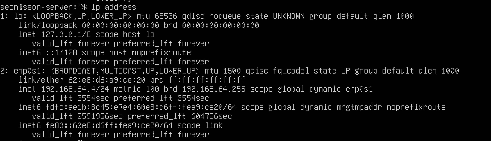

# [번외] SSH로 로컬 리눅스 서버 접근하기

이 장에서는 VirtualBox 또는 UTM과 같은 가상 머신 환경에서 로컬 리눅스 서버에 SSH로 접근하는 방법을 다룬다. 네트워크 설정 방식에 따라 브리지 모드와 NAT 모드로 나뉘며, 각각의 설정 방법과 연결 방법을 소개한다.


## 1. 브리지를 이용한 방법

### 가상 머신 네트워크 설정

- 가상 머신의 네트워크 어댑터를 **브리지 모드**로 설정한다.

#### VirtualBox 설정 예시


#### UTM 설정 예시


### 리눅스 SSH 서버 설치 및 실행

```bash
$ sudo apt install openssh-server
$ sudo systemctl start ssh
$ sudo systemctl enable ssh
```

- `openssh-server`를 설치하고 SSH 서비스를 시작 및 부팅 시 자동 실행 설정을 한다.


### 로컬 리눅스 서버의 IP 확인


- ip address 명령어로 ip 확인





### 클라이언트에서 SSH 접속

- PowerShell(Windows) 또는 터미널(macOS)에서 접속

```bash
$ ssh {username}@{ip주소}
```

- 접속 시 `yes` 입력 후 비밀번호를 입력하여 로그인한다.


## 2. NAT를 이용한 방법

NAT 모드로 설정한 경우, 포트 포워딩을 통해 접근이 가능하다. 아래 블로그를 참고하여 설정할 수 있다.

- [VirtualBox 네트워크 설정 - NAT 및 포트포워딩 방법](https://velog.io/@xeomina/VirtualBox-%EB%84%A4%ED%8A%B8%EC%9B%8C%ED%81%AC-%EC%84%A4%EC%A0%95)


## 요약

1. 브리지 모드를 사용하면 동일 네트워크에 있는 것처럼 SSH 접속이 가능하다.
2. SSH 서버를 설치하고 실행한 뒤, IP를 확인하여 접속할 수 있다.
3. NAT 모드의 경우 포트포워딩 설정이 필요하며, VirtualBox에서 수동 설정이 요구된다.