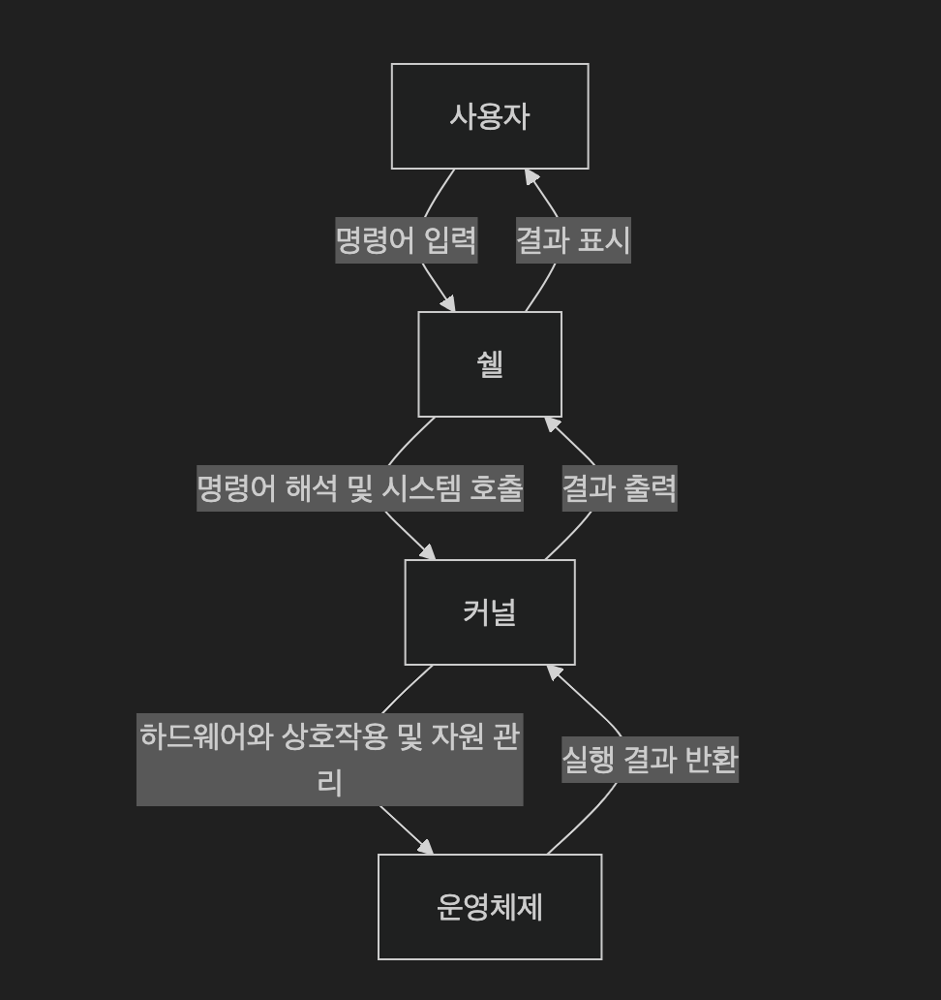

# 6. 쉘

## 쉘의 개념과 종류

- 사용자와 커널 사이에서 명령을 해석하고 실행하는 인터페이스
- 명령어를 해석하여 커널에 전달하고, 결과를 사용자에게 반환함

### 쉘의 주요 기능

- 명령어 해석 기능
- 자체적인 프로그래밍 기능 (쉘 스크립트를 통한 자동화 기능)
- 사용자 환경 변수 및 설정 기능

### 주요 쉘 종류

| 쉘 종류 | 특징 |
|---------|------|
| **Bash** | 가장 널리 사용됨. 기능과 스크립트 호환성 뛰어남 |
| **Zsh**  | 사용자 친화적. 자동 완성, 테마 등 커스터마이징 가능 |
| **Ksh**  | 고성능 스크립팅 기능 제공 |
| **Tcsh** | C 스타일 문법을 제공하는 향상된 C 쉘 |

## 쉘의 명령어 해석 기능

쉘은 명령어를 해석하여 커널에 전달하고, 결과를 사용자에게 출력하는 역할을 한다.




## 내장 명령어 vs 외부 명령어

### 쉘 내장 명령어 (Built-in Commands)

- 쉘 내부에 포함된 명령어로 별도 프로세스를 생성하지 않음
- 빠르고, 셸 환경 제어에 적합함

| 명령어 | 설명 |
|--------|------|
| `echo` | 문자열 출력 |
| `alias` | 별칭 설정 |
| `export` | 환경 변수 설정 |
| `cd` | 디렉터리 이동 |
| `pwd` | 현재 디렉터리 출력 |
| `type` | 명령어 유형 확인 |
| `unset` | 셸 변수 제거 |
| `help` | 내장 명령어 도움말 |
| `history` | 명령어 기록 확인 |

### 외부 명령어 (External Commands)

- 별도의 실행 파일로 존재하며 쉘에서 호출 시 새 프로세스를 생성
- 주로 시스템 명령어나 유틸리티 도구

| 명령어 | 설명 |
|--------|------|
| `date` | 현재 시간 출력 |
| `clear` | 터미널 화면 정리 |
| `man`, `whatis` | 도움말 확인 |
| `ls`, `cp`, `mv`, `rm` | 파일/디렉터리 조작 |
| `grep`, `find`, `cat` | 텍스트 처리 및 검색 |
| `ps` | 프로세스 목록 보기 |
| `python` | 파이썬 파일 실행 |

### 명령어 타입 확인

```bash
$ type cd      # cd is a shell builtin
$ type ls      # ls is /bin/ls
$ type man     # man is /usr/bin/man
```

## 쉘의 스크립트 기능

- `.sh` 확장자의 스크립트 파일을 실행하여 명령어들을 자동으로 실행 가능
- 쉘 스크립트는 10장에서 자세히 학습함


## 사용자 환경 설정 기능

### 환경 변수란?

- 시스템 및 사용자 설정을 나타내는 전역 변수

| 변수 | 설명 |
|--------|------|
| `HOME` | 사용자 홈 디렉터리 |
| `USER` | 사용자 이름 |
| `SHELL` | 기본 셸 종류 |
| `LANG` | 언어/지역 설정 |
| `PATH` | 실행 가능한 경로 목록 |

### 환경 변수 확인

```bash
$ echo $PATH
```

### 환경 변수 설정

- 일시적 설정:

```bash
$ export MY_VAR=123
```

- 영구적 설정:

```bash
$ echo 'export MY_VAR=123' >> ~/.bashrc
$ source ~/.bashrc
```

- export 를 사용하지 않은 경우 셸 세션 내에서만 유효

## 사용자 정의 함수 (함수 만들기)

### 예: 디렉터리 생성 후 바로 이동하는 함수

```bash
$ mkcd() {
  mkdir -p "$1"
  cd "$1"
}
```

- 영구 적용하려면 `~/.bashrc`에 추가:

```bash
$ echo 'mkcd() { mkdir -p "$1"; cd "$1"; }' >> ~/.bashrc
$ source ~/.bashrc
```

- 사용 예시:

```bash
$ mkcd my_project
```

## [실습] bash shell (10분)
- [실습: bash shell](training/shell.md)


## [번외] 로그인 시 동작 과정

- [번외: bash 로그인 과정 및 환경 설정](extra/login.md)

## 요약

1. 리눅스 쉘은 커널과 사용자 사이에서 명령어를 해석하는 인터페이스이다.
2. 내장 명령어와 외부 명령어는 구조와 실행 방식이 다르며, `type` 명령어로 구분할 수 있다.
3. 쉘은 스크립트 실행, 환경 변수 설정, 사용자 정의 함수 등 다양한 기능을 제공한다.