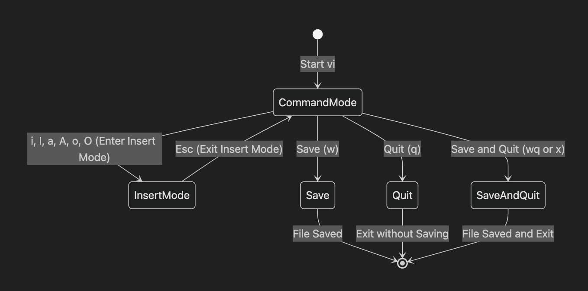

# 7. 텍스트 편집기(vi)

이 장에서는 리눅스에서 기본적으로 제공되는 강력한 편집기인 `vi`의 개념과 특징, 그리고 활용 방법에 대해 알아본다.

## vi 에디터란?

- `vi`는 유닉스 및 리눅스 시스템에서 널리 사용되는 기본 텍스트 편집기이다.
- 빠르고 가볍고, 대부분의 시스템에 기본 설치되어 있다.
- 마우스를 사용하지 않고 키보드만으로 조작한다.

## vi와 vim (용어 정리)

| 용어 | 설명 |
|------|------|
| `vi` | 기본적인 텍스트 편집기, 유닉스 계열 시스템에 기본 포함 |
| `vim` | `vi improved`, vi의 확장판으로 다양한 추가 기능 제공 |

> 대부분의 리눅스에서는 `vi` 명령어를 입력하면 실제로는 `vim`이 실행된다.


## vi의 주요 특징

1. **가볍고 빠름** – 최소한의 자원으로도 실행 가능
2. **모드 기반 편집** – 명령 모드, 입력 모드, 비주얼 모드 등
3. **정밀한 커서 이동 및 편집 기능** – 단어, 줄, 문단 단위 편집 가능
4. **강력한 검색 및 치환** – 정규표현식 기반 명령 사용 가능
5. **확장성** – `.vimrc` 설정 파일로 커스터마이징 가능
6. **플랫폼 독립적** – 다양한 시스템에서 동일한 사용 경험
7. **다양한 명령어 제공** – `u` (되돌리기), `.` (마지막 명령 반복), `yy`, `p` 등

## vi의 편집 모드 구조




## vi 에디터 활용

### 1. 파일 열기 및 생성

```bash
$ vi filename.txt
```

- 입력한 파일이 존재하지 않으면 새로 생성된다.

### 2. 입력 모드 진입

- `i`, `a`, `o` 등을 눌러 입력 모드로 진입
- 텍스트 입력 가능

### 3. 명령 모드 복귀

- `Esc` 키를 눌러 명령 모드로 복귀

### 4. 저장 및 종료 명령어

| 명령 | 설명 |
|-------|------|
| `:w` | 저장 |
| `:q` | 종료 |
| `:wq`, `:x` | 저장 후 종료 |
| `:q!` | 저장하지 않고 종료 |

### 5. 기본 커서 이동

| 방향 | 키 |
|--------|----|
| 왼쪽 | `h` |
| 아래 | `j` |
| 위 | `k` |
| 오른쪽 | `l` |

> 방향키도 사용 가능하지만, `vi`는 위의 키를 기본 커서 이동 방식으로 사용한다.

## [실습] vi 로 간단한 텍스트 입력해서 파일 만들기 (10분)

- [실습: vi 텍스트 입력](training/simple.md)

## 요약

1. `vi`는 대부분의 리눅스 시스템에 기본 내장된 텍스트 편집기이다.
2. 모드 기반 편집 구조로 구성되어 있으며, 입력과 명령 기능을 분리하여 제공한다.
3. 명령어 기반 조작으로 빠르고 유연한 편집이 가능하다.
4. 저장과 종료는 `:wq`, `:x`, `:q!` 등을 사용하며, `Esc`로 명령 모드로 진입해야 한다.