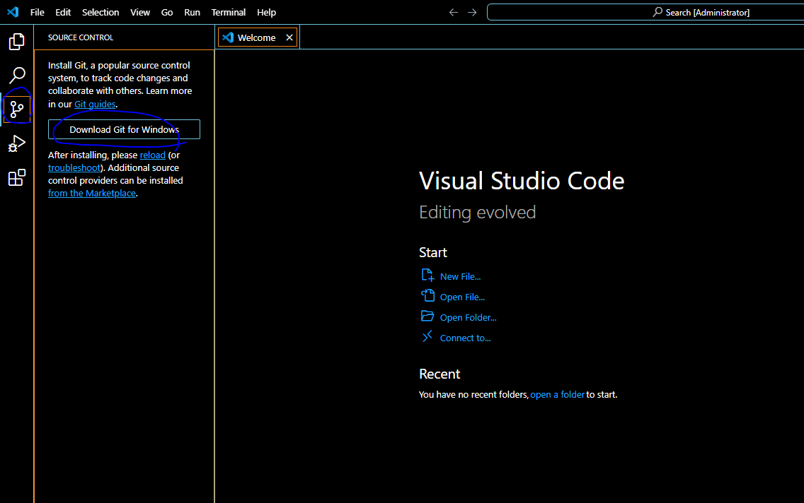

# [번외] VSCode 로 git 연동하기

- git 다운 받고 모두 기본으로 설치

Git Hub repository 생성

- Git 리포지토리 복제 > 이후 ssh url 입력

### ssh 키 생성

window

[https://oingdaddy.tistory.com/453](https://oingdaddy.tistory.com/453)

mac

[https://xho95.github.io/macos/security/openssh/ssh/gitlab/2017/02/22/Using-SSH-on-Mac.html](https://xho95.github.io/macos/security/openssh/ssh/gitlab/2017/02/22/Using-SSH-on-Mac.html)

### new ssh key 에 등록