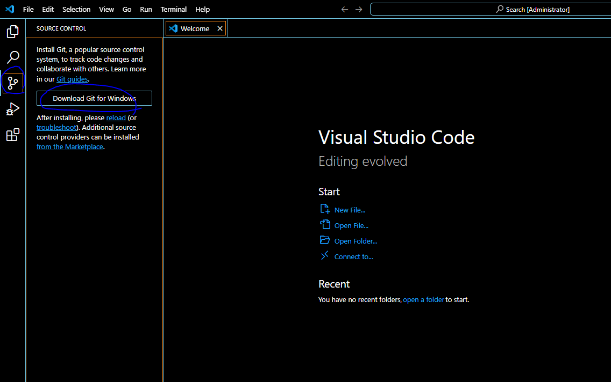

# [번외] VSCode 로 git 연동하기




- git 다운 받고 모두 기본으로 설치

Git Hub repository 생성


- Git 리포지토리 복제 > 이후 ssh url 입력


### SSH 키 생성

SSH 키는 내 컴퓨터와 GitHub를 연결할 때 사용하는 인증 파일이다.
Windows와 macOS 모두 아래 명령어로 생성할 수 있다.

#### Windows

PowerShell 또는 Git Bash를 실행한다.

```bash
ssh-keygen -t rsa -b 4096 -C "you@example.com"
```

중간에 저장 위치를 물어보면 Enter를 눌러 기본 위치를 사용한다.
비밀번호를 물어보면 수업에서는 Enter를 눌러 비워 두어도 된다.

생성된 공개키를 확인한다.

```bash
cat ~/.ssh/id_rsa.pub
```

PowerShell에서 `cat` 명령이 잘 안 되면 아래 명령을 사용한다.

```powershell
type $env:USERPROFILE\.ssh\id_rsa.pub
```

#### macOS

Terminal 앱을 실행한다.

```bash
ssh-keygen -t rsa -b 4096 -C "you@example.com"
```

중간에 저장 위치를 물어보면 Enter를 눌러 기본 위치를 사용한다.
비밀번호를 물어보면 수업에서는 Enter를 눌러 비워 두어도 된다.

생성된 공개키를 확인한다.

```bash
cat ~/.ssh/id_rsa.pub
```

출력된 내용 전체를 복사한다.
공개키는 보통 `ssh-rsa`로 시작하고, 마지막에 이메일 또는 컴퓨터 이름이 붙는다.


### New SSH key 에 등록

1. GitHub 오른쪽 상단 프로필을 클릭한다.
2. Settings 로 들어간다.
3. 왼쪽 메뉴에서 SSH and GPG keys 를 선택한다.
4. New SSH key 를 클릭한다.
5. Title 에 구분하기 쉬운 이름을 입력한다.
    - 예: `window pc`
    - 예: `macbook`
6. Key 칸에 `id_rsa.pub` 내용을 붙여넣는다.
7. Add SSH key 를 클릭한다.

등록이 끝나면 아래 명령어로 연결을 확인할 수 있다.

```bash
ssh -T git@github.com
```

처음 연결할 때 `Are you sure you want to continue connecting?` 메시지가 나오면 `yes`를 입력한다.
