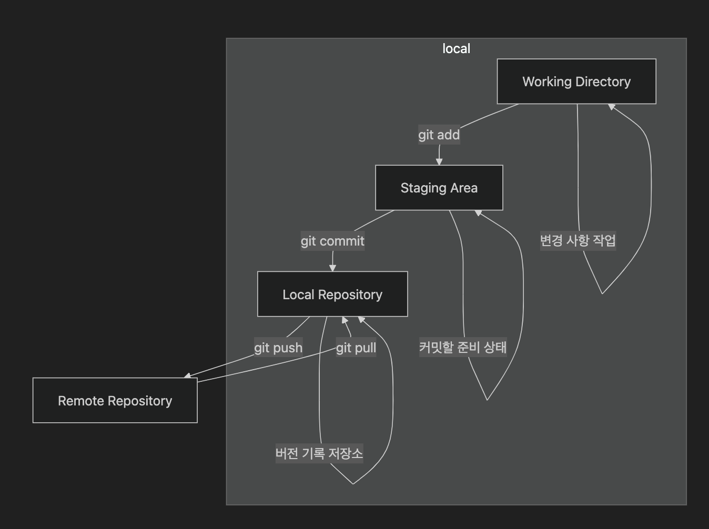

# 19. Git 과 GitHub

## Git 소개

* 2005년 리누스 토르발스가 개발한 **분산 버전 관리 시스템**.
* 코드 변경 이력 관리, 다수의 개발자 협업을 지원.
  - 파일의 모든 변경 이력을 스냅샷처럼 기록해 실수 시 언제든 과거 상태로 돌아갈 수 있고, 원격 저장소를 통해 팀원과 변경 사항을 손쉽게 공유해 협업을 지원한다.


## 주요 개념 및 기능

### 1. 버전 관리

* 모든 변경 사항은 커밋(commit)으로 저장되며, 고유한 해시 값으로 식별됨.

### 2. 분산형 구조

* 모든 개발자는 **로컬 저장소**를 가지고 작업하며, 필요 시 원격 저장소와 동기화함.

### 3. 브랜치와 병합

* 브랜치(branch)를 통해 독립적 작업 가능.
* 병합(merge)을 통해 메인 브랜치로 통합.

### 4. 커밋

* 커밋은 작업 스냅샷이며, 메시지를 통해 설명 가능.

### 5. 리모트 저장소

* GitHub, GitLab, Bitbucket 등 원격 저장소와 연결하여 협업 가능.

### 6. pull과 push

* `git pull`: 원격 -> 로컬
* `git push`: 로컬 -> 원격

### 7. 태그(tag)

* 특정 커밋에 이름을 붙여 릴리즈 버전 등을 관리.


## 비유를 통한 개념 이해

| 개념  | 비유 설명                          |
| --- | ------------------------------ |
| 저장소 | 책 작업실                          |
| 커밋  | "오늘 여기까지 썼다" 메모가 있는 저장본        |
| 브랜치 | 책의 여러 초안을 동시에 작성               |
| 병합  | 여러 초안을 하나의 최종 원고로 통합           |
| 충돌  | 같은 내용을 서로 다르게 수정해 충돌한 경우 해결 필요 |

## Git 내부 구조

* **객체 데이터베이스** 기반

  * 블롭(blob): 파일 내용
  * 트리(tree): 디렉토리 구조
  * 커밋(commit): 특정 시점의 트리 가리킴
  * 태그(tag): 커밋에 이름 부여

## Git의 장점

1. **빠른 속도**: 대부분 작업이 로컬에서 수행됨.
2. **데이터 무결성**: 모든 데이터는 해시 기반으로 신뢰도 높음.
3. **강력한 브랜칭 모델**: 실험과 기능 개발을 안전하게 수행.

## Git의 3가지 상태




## Git 기본 명령어 실습

```bash
# 사용자 설정 (파일은 수정한 사람 정보를 지정한다)
$ git config --global user.name "Your Name"
$ git config --global user.email "you@example.com"

# 로컬 저장소 생성 (git 으로 관리하고 싶은 디렉터리를 만들고 저장소로 지정한다)
$ mkdir my_project && cd my_project
$ git init

# 파일 추가 및 커밋 (디렉터리에 변경 사항을 만들고 기록한다)
$ echo "Hello, Git!" > hello.txt
$ git add hello.txt
$ git commit -m "Add hello.txt"

# 파일 수정 후 상태 및 변경 확인 (기록한 이후의 변경 사항에 대해서 git 이 인지하는 것을 확인한다)
$ echo "This is a Git tutorial." >> hello.txt
$ git status
$ git diff

# 변경 사항 저장 및 커밋 (다시 git 에 변경 사항을 기록한다)
$ git add hello.txt
$ git commit -m "Update hello.txt with tutorial message"

# 브랜치 생성 및 병합 (변경 사항이 있는 브랜치를 새로 만들고 수정 후 내용을 메인 브랜치에 적용한다)
$ git branch new-feature
$ git checkout new-feature
$ echo "Feature" >> hello.txt
$ git add hello.txt
$ git commit -m "Add feature"
$ git checkout main
$ git merge new-feature
```

- git add 상태가 있는건 모든 파일을 커밋으로 기록하고 싶지 않으니, add 를 통해서 스테이지로 올린 다음 그것 들만 commit 한다
- 커밋을 하면 이력으로 남아서 수정 사항이 기록된다.


## GitHub 개요

* Git 기반 코드 호스팅 플랫폼
* 코드 협업, 리뷰, 프로젝트 관리, CI/CD 등 지원

### 주요 기능

| 기능             | 설명                            |
| -------------- | ----------------------------- |
| 저장소 호스팅        | 공개/비공개 저장소 제공, 팀 단위 협업 지원     |
| 이슈 관리          | 버그 및 기능 요청 추적용 이슈 생성/관리       |
| Pull Request   | 브랜치 병합 전 코드 리뷰 및 승인 과정        |
| 프로젝트 보드        | 작업 항목을 시각화하는 칸반 보드 등 관리 도구 제공 |
| GitHub Actions | 코드 변경 시 자동화 (빌드/테스트/배포 등)     |
| 위키             | 프로젝트 관련 문서 관리                 |
| 보안 기능          | 코드 스캔, 취약점 감지, 의존성 경고 등       |


## 기존 원격 저장소 작업물을 로컬로 가져오기

```
# 원격 저장소 클론
git clone <https://github.com/username/existing-project.git>

# 클론된 디렉토리로 이동
cd <existing-project>

# 새로운 브랜치 생성 및 체크아웃
git checkout -b new-feature

# 파일 수정 후 커밋
echo "Some changes" >> file.txt
git add file.txt
git commit -m "Modify file.txt"

# 원격 저장소에 푸시 (원격 저장소에 권한이 있어야 푸시 가능)
git push origin new-feature
```

## github(원격 저장소에 키 등록하기)

```bash
# SSH 키 생성 및 등록 (-C 생략 가능)
$ ssh-keygen -t rsa -b 4096 -C "you@example.com"
cat ~/.ssh/id_rsa.pub
```

1. GitHub 웹사이트에 로그인 후 오른쪽 상단 프로필 → Settings 로 이동

2. 왼쪽 메뉴에서 SSH and GPG keys 선택

3. New SSH key 버튼 클릭

4. Title: 키를 구분할 이름(예: “linux server, window pc”)

5. id_rsa.pub 내용 붙여넣기

6. Add SSH key 클릭

## 로컬 작업물 원격 저장소에 등록하기

```bash
# 원격 저장소 연결
$ git remote add origin <git@github.com:username/repo.git>

# 파일 추가 및 커밋
$ git add .
$ git commit -m "initial commit"

# 푸시
$ git push origin main
```

## GitHub 파일 다운로드

```bash
# wget 사용
$ wget https://github.com/user/repo/raw/branch/file.txt

# curl 사용
$ curl -O https://github.com/user/repo/raw/branch/file.txt
```


## [번외] Git 연동 및 확장

* [[번외] VSCode 로 git 연동하기](extra/vscode.md)
* [[번외] Git Flow](extra/gitflow.md)
* [[번외] Homebrew](extra/homebrew.md)
