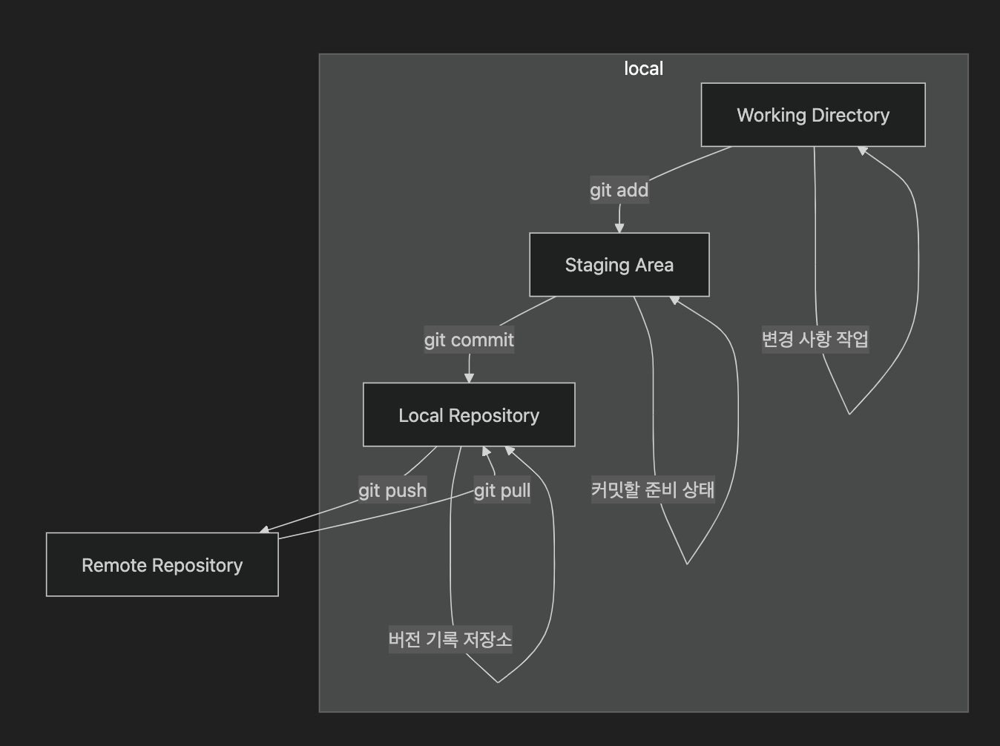

# 19. Git 과 GitHub

## Git 소개

Git은 파일의 변경 이력을 저장하는 도구이다.
GitHub는 Git으로 관리하는 저장소를 인터넷에 올려두는 서비스이다.

Git의 원래 목적은 파일이 언제, 어떻게 바뀌었는지 이력을 관리하는 것이다.
하지만 바이오 분석 실습에서는 이력 관리 자체보다, 분석 코드와 설정 파일을 하나의 저장소 단위로 묶어 관리하고 공유하는 관점이 더 중요하게 쓰이는 경우가 많다.

예를 들어 한 분석 프로젝트에는 아래 파일들이 함께 들어갈 수 있다.

| 파일 | 역할 |
| --- | --- |
| `script.py`, `run.sh` | 분석을 실행하는 코드 또는 스크립트 |
| `environment.yml` | Conda 분석 환경 정의 |
| `Dockerfile` | Docker 실행 환경 정의 |
| `README.md` | 실행 방법과 데이터 설명 |
| `config.yaml` | 분석에 필요한 설정값 |

이런 파일들을 GitHub 저장소에 올려두면, 다른 컴퓨터나 리눅스 서버에서도 같은 저장소를 가져와 분석 코드를 실행할 수 있다.
따라서 수업에서는 복잡한 브랜치 전략보다, 저장소를 만들고 GitHub와 연동해 코드를 쉽게 올리고 가져오는 흐름을 먼저 익힌다.

1. 내 컴퓨터의 폴더를 Git 저장소로 만든다.
2. 파일을 수정한다.
3. 수정 내용을 커밋으로 저장한다.
4. GitHub 저장소와 연결한다.
5. GitHub로 푸시한다.

## 저장소 개념

| 개념 | 의미 |
| --- | --- |
| 작업 폴더 | 실제 파일을 만들고 수정하는 폴더 |
| 로컬 저장소 | 내 컴퓨터에 있는 Git 저장소. 폴더 안의 `.git` 디렉터리에 변경 이력이 저장된다. |
| 원격 저장소 | GitHub에 있는 저장소. 다른 컴퓨터나 사람과 공유할 수 있다. |
| 커밋 | 특정 시점의 변경 내용을 저장한 기록 |
| 푸시 | 로컬 저장소의 커밋을 GitHub 원격 저장소로 올리는 작업 |
| 풀 | GitHub 원격 저장소의 최신 내용을 로컬 저장소로 가져오는 작업 |

예를 들어 `linux_practice`라는 폴더에서 실습 파일을 만들고 Git으로 관리하면, 그 폴더가 로컬 저장소가 된다.
이 저장소를 GitHub의 `linux_practice` 저장소와 연결하면, 내 컴퓨터의 작업물을 GitHub에 올릴 수 있다.

## Git의 3가지 상태



Git은 파일 변경 내용을 바로 저장하지 않는다.
먼저 저장할 파일을 고르고, 그 다음 커밋으로 기록한다.

| 상태 | 의미 | 관련 명령어 |
| --- | --- | --- |
| Working Directory | 파일을 수정한 상태 | `git status`, `git diff` |
| Staging Area | 커밋에 포함할 파일을 골라둔 상태 | `git add` |
| Repository | 커밋으로 저장된 상태 | `git commit` |

## 준비물

1. Git
2. Visual Studio Code
3. GitHub 계정

## Git 설치

### Windows

1. [Git 공식 사이트](https://git-scm.com/)에 접속한다.
2. Download for Windows를 클릭한다.
3. 설치 파일을 실행한다.
4. 설치 옵션은 수업에서는 기본값으로 진행해도 된다.
5. 설치가 끝나면 VS Code를 다시 실행한다.

설치 확인:

```bash
$ git --version
```

### macOS

```bash
$ git --version
```

위 명령어를 실행했을 때 설치 안내가 나오면 안내에 따라 설치한다.
Homebrew를 사용한다면 아래처럼 설치할 수도 있다.

```bash
$ brew install git
```

### Ubuntu

```bash
$ sudo apt update
$ sudo apt install git -y
$ git --version
```

## Git 사용자 정보 설정

Git을 처음 설치했다면 커밋에 남길 이름과 이메일을 설정한다.
이 정보는 GitHub 계정 이메일과 같게 쓰는 것이 관리하기 쉽다.

VS Code에서 `Terminal > New Terminal`을 열고 실행한다.

```bash
$ git config --global user.name "Your Name"
$ git config --global user.email "you@example.com"
```

의미:

| 명령어 | 의미 |
| --- | --- |
| `git config --global user.name` | 내 컴퓨터에서 만드는 커밋의 작성자 이름 설정 |
| `git config --global user.email` | 내 컴퓨터에서 만드는 커밋의 작성자 이메일 설정 |

## VS Code에서 새 Git 저장소 만들기

### 1. 실습 폴더 열기

1. VS Code를 실행한다.
2. `File > Open Folder`를 클릭한다.
3. Git으로 관리할 실습 폴더를 선택한다.
   - 예: `linux_practice`
4. 왼쪽의 Source Control 아이콘을 클릭한다.

### 2. 저장소 초기화

Source Control 화면에서 `Initialize Repository`를 클릭한다.

의미:

| VS Code 동작 | Git 명령어 | 의미 |
| --- | --- | --- |
| Initialize Repository | `git init` | 현재 폴더를 Git 로컬 저장소로 만든다. |

초기화가 끝나면 폴더 안에 숨김 디렉터리인 `.git`이 만들어진다.
이때부터 Git은 이 폴더의 변경 이력을 기록할 수 있다.

### 3. 파일 만들기

예를 들어 `README.md` 파일을 만들고 아래 내용을 입력한다.

```markdown
# linux_practice

Linux 수업 실습 저장소
```

파일을 저장하면 Source Control 화면에 변경된 파일이 표시된다.

의미:

| VS Code 화면 | Git 명령어 | 의미 |
| --- | --- | --- |
| Changes에 파일 표시 | `git status` | Git이 아직 커밋하지 않은 변경 사항을 인식한 상태 |

### 4. 커밋할 파일 선택

Source Control 화면에서 파일 옆의 `+` 버튼을 누른다.
여러 파일을 한 번에 올리고 싶다면 `Changes` 옆의 `+` 버튼을 누른다.

의미:

| VS Code 동작 | Git 명령어 | 의미 |
| --- | --- | --- |
| 파일 옆 `+` 클릭 | `git add README.md` | 해당 파일을 다음 커밋에 포함하도록 선택 |
| Changes 옆 `+` 클릭 | `git add .` | 현재 폴더의 변경 파일을 한 번에 스테이징 |

`git add`는 GitHub에 올리는 명령이 아니다.
커밋에 포함할 파일을 고르는 단계이다.

### 5. 커밋 만들기

Source Control 상단의 메시지 입력 칸에 커밋 메시지를 입력한다.

예:

```text
Add README
```

그 다음 `Commit` 버튼을 클릭한다.

의미:

| VS Code 동작 | Git 명령어 | 의미 |
| --- | --- | --- |
| 메시지 입력 후 Commit | `git commit -m "Add README"` | 선택한 변경 사항을 하나의 기록으로 저장 |

커밋은 "이 시점까지 작업한 내용을 저장했다"는 기록이다.
커밋을 해도 아직 GitHub에 올라간 것은 아니다.

## GitHub 저장소 만들기

1. GitHub에 로그인한다.
2. 오른쪽 위 `+` 버튼을 클릭한다.
3. `New repository`를 선택한다.
4. Repository name을 입력한다.
   - 예: `linux_practice`
5. Public 또는 Private을 선택한다.
6. 수업에서는 처음 연동을 쉽게 하기 위해 `Add a README file`은 체크하지 않는다.
7. `Create repository`를 클릭한다.

생성 후 나오는 저장소 주소를 복사한다.

HTTPS 예:

```text
https://github.com/username/linux_practice.git
```

SSH 예:

```text
git@github.com:username/linux_practice.git
```

처음에는 HTTPS가 더 간단하다.
SSH 방식은 키 등록이 필요하다.

## VS Code에서 GitHub 저장소와 연결하기

### 방법 1. Publish Branch 사용

VS Code에서 GitHub 로그인이 되어 있으면 Source Control 화면에 `Publish Branch` 버튼이 보일 수 있다.

1. `Publish Branch`를 클릭한다.
2. GitHub 로그인을 요청하면 로그인한다.
3. Public 또는 Private 저장소를 선택한다.
4. VS Code가 GitHub 저장소를 만들고 현재 커밋을 업로드한다.

의미:

| VS Code 동작 | Git 명령어 | 의미 |
| --- | --- | --- |
| Publish Branch | `git remote add origin ...` | 로컬 저장소와 GitHub 저장소 연결 |
| Publish Branch | `git push -u origin main` | 로컬 커밋을 GitHub에 처음 업로드 |

### 방법 2. 이미 만든 GitHub 저장소 주소 연결

GitHub에서 저장소를 먼저 만들었다면 VS Code 터미널에서 아래 명령어를 실행한다.

```bash
$ git remote add origin https://github.com/username/linux_practice.git
$ git push -u origin main
```

의미:

| 명령어 | 의미 |
| --- | --- |
| `git remote add origin ...` | GitHub 저장소 주소를 `origin`이라는 이름으로 등록 |
| `git push -u origin main` | 로컬 저장소의 `main` 내용을 GitHub의 `origin`으로 처음 업로드 |

만약 현재 브랜치 이름이 `master`라면 아래 명령어를 사용한다.

```bash
$ git push -u origin master
```

현재 브랜치 이름 확인:

```bash
$ git branch --show-current
```

## 이후 수정 사항을 GitHub에 올리는 방법

처음 연결이 끝난 뒤에는 아래 순서만 반복하면 된다.

1. 파일을 수정한다.
2. Source Control에서 변경 파일을 확인한다.
3. `+` 버튼으로 스테이징한다.
4. 커밋 메시지를 입력하고 `Commit`을 누른다.
5. `Sync Changes` 또는 `Push`를 누른다.

명령어로 쓰면 아래와 같다.

```bash
$ git status
$ git add .
$ git commit -m "Update practice files"
$ git push
```

의미:

| 단계 | VS Code 동작 | Git 명령어 |
| --- | --- | --- |
| 변경 확인 | Source Control에서 변경 파일 확인 | `git status` |
| 커밋할 파일 선택 | `+` 클릭 | `git add .` |
| 기록 저장 | `Commit` 클릭 | `git commit -m "메시지"` |
| GitHub에 올리기 | `Push` 또는 `Sync Changes` 클릭 | `git push` |

## GitHub 저장소를 내 컴퓨터로 가져오기

이미 GitHub에 있는 저장소를 내 컴퓨터에서 작업하려면 clone을 사용한다.

VS Code에서:

1. `View > Command Palette`를 연다.
2. `Git: Clone`을 입력하고 선택한다.
3. GitHub 저장소 주소를 입력한다.
4. 저장할 폴더 위치를 선택한다.
5. 클론이 끝나면 `Open`을 클릭한다.

의미:

| VS Code 동작 | Git 명령어 | 의미 |
| --- | --- | --- |
| Git: Clone | `git clone https://github.com/username/repo.git` | GitHub 저장소 전체를 내 컴퓨터로 복사 |

터미널에서는 아래처럼 실행한다.

```bash
$ git clone https://github.com/username/repo.git
$ cd repo
```

## 작업 전 최신 내용 가져오기

다른 컴퓨터에서 수정했거나, 다른 사람이 GitHub에 먼저 올린 내용이 있다면 작업 전에 최신 내용을 가져온다.

VS Code에서 `Sync Changes`를 누르거나, 터미널에서 아래 명령어를 실행한다.

```bash
$ git pull
```

의미:

| VS Code 동작 | Git 명령어 | 의미 |
| --- | --- | --- |
| Sync Changes | `git pull` + `git push` | GitHub의 최신 내용을 가져오고, 내 커밋도 업로드 |
| Pull | `git pull` | GitHub의 최신 내용을 로컬로 가져오기 |

혼자 작업하더라도 여러 컴퓨터를 사용한다면 작업 전에 `pull`, 작업 후에 `push`를 습관화하는 것이 좋다.

## SSH 키로 GitHub 연결하기

VS Code의 GitHub 로그인 또는 HTTPS 방식으로도 충분히 사용할 수 있다.
다만 서버나 리눅스 환경에서 자주 작업한다면 SSH 키를 등록해두면 편하다.

SSH 키 생성:

```bash
$ ssh-keygen -t rsa -b 4096 -C "you@example.com"
```

중간에 저장 위치를 물어보면 Enter를 눌러 기본 위치를 사용한다.
비밀번호를 물어보면 수업에서는 Enter를 눌러 비워 두어도 된다.

공개키 확인:

```bash
$ cat ~/.ssh/id_rsa.pub
```

PowerShell에서는 아래 명령어를 사용할 수 있다.

```powershell
type $env:USERPROFILE\.ssh\id_rsa.pub
```

GitHub에 등록:

1. GitHub 오른쪽 상단 프로필을 클릭한다.
2. `Settings`로 이동한다.
3. 왼쪽 메뉴에서 `SSH and GPG keys`를 선택한다.
4. `New SSH key`를 클릭한다.
5. Title에 구분하기 쉬운 이름을 입력한다.
   - 예: `windows pc`
   - 예: `linux server`
6. Key 칸에 `id_rsa.pub` 내용을 붙여넣는다.
7. `Add SSH key`를 클릭한다.

연결 확인:

```bash
$ ssh -T git@github.com
```

처음 연결할 때 `Are you sure you want to continue connecting?` 메시지가 나오면 `yes`를 입력한다.

SSH 주소를 쓰는 경우 원격 저장소 연결 명령어는 아래처럼 된다.

```bash
$ git remote add origin git@github.com:username/linux_practice.git
$ git push -u origin main
```

## 리눅스 서버에서 GitHub 코드 연동하기

서버에서는 보통 브라우저 로그인을 쓰기 어렵기 때문에 SSH 공개키를 GitHub에 등록해서 권한을 관리한다.
서버에 있는 개인키는 서버 밖으로 복사하지 않고, 공개키(`.pub`)만 GitHub에 등록한다.

### 1. 서버에 Git 설치

```bash
$ sudo apt update
$ sudo apt install git -y
$ git --version
```

의미:

| 명령어 | 의미 |
| --- | --- |
| `sudo apt install git -y` | 리눅스 서버에 Git 설치 |
| `git --version` | Git 설치 여부 확인 |

### 2. 서버에서 SSH 키 생성

서버에 접속한 뒤 아래 명령어를 실행한다.

```bash
$ ssh-keygen -t rsa -b 4096 -C "you@example.com"
```

중간에 저장 위치를 물어보면 Enter를 눌러 기본 위치를 사용한다.
기본 위치를 사용하면 보통 아래 파일이 만들어진다.

```text
~/.ssh/id_rsa
~/.ssh/id_rsa.pub
```

| 파일 | 의미 |
| --- | --- |
| `id_rsa` | 개인키. 서버 안에만 보관하고 외부에 공유하지 않는다. |
| `id_rsa.pub` | 공개키. GitHub에 등록해도 되는 키이다. |

### 3. 공개키 확인

```bash
$ cat ~/.ssh/id_rsa.pub
```

출력된 내용 전체를 복사한다.
보통 `ssh-rsa`로 시작하고 마지막에 이메일 또는 서버 이름이 붙는다.

### 4. GitHub에 공개키 등록

1. GitHub에 로그인한다.
2. 오른쪽 상단 프로필을 클릭한다.
3. `Settings`로 이동한다.
4. 왼쪽 메뉴에서 `SSH and GPG keys`를 선택한다.
5. `New SSH key`를 클릭한다.
6. Title에 서버를 구분할 이름을 적는다.
   - 예: `bio linux server`
   - 예: `ubuntu practice server`
7. Key 칸에 `id_rsa.pub` 내용을 붙여넣는다.
8. `Add SSH key`를 클릭한다.

### 5. 서버에서 GitHub 연결 확인

```bash
$ ssh -T git@github.com
```

처음 연결하면 아래와 비슷한 질문이 나올 수 있다.

```text
Are you sure you want to continue connecting (yes/no/[fingerprint])?
```

`yes`를 입력한다.
정상적으로 등록되었다면 GitHub 사용자 이름이 포함된 인증 성공 메시지가 나온다.

의미:

| 명령어 | 의미 |
| --- | --- |
| `ssh -T git@github.com` | 현재 서버의 SSH 키로 GitHub 인증이 되는지 확인 |

### 6. GitHub 저장소를 서버로 가져오기

GitHub 저장소 페이지에서 `Code` 버튼을 누르고 `SSH` 주소를 복사한다.

예:

```text
git@github.com:username/linux_practice.git
```

서버에서 원하는 위치로 이동한 뒤 clone한다.

```bash
$ cd ~
$ git clone git@github.com:username/linux_practice.git
$ cd linux_practice
```

의미:

| 명령어 | 의미 |
| --- | --- |
| `git clone git@github.com:username/linux_practice.git` | GitHub 저장소를 서버로 복사 |
| `cd linux_practice` | 복사된 저장소 폴더로 이동 |

### 7. 서버에서 최신 코드 가져오기

이미 clone한 저장소가 있고, GitHub의 최신 내용을 서버로 가져오고 싶다면 저장소 폴더 안에서 실행한다.

```bash
$ git pull
```

의미:

| 명령어 | 의미 |
| --- | --- |
| `git pull` | GitHub 원격 저장소의 최신 커밋을 서버의 로컬 저장소로 가져오기 |

### 8. 서버에서 수정한 코드를 GitHub에 올리기

서버에서 파일을 수정했다면 아래 순서로 올린다.

```bash
$ git status
$ git add .
$ git commit -m "Update server code"
$ git push
```

의미:

| 명령어 | 의미 |
| --- | --- |
| `git status` | 수정된 파일 확인 |
| `git add .` | 수정 파일을 커밋 대상에 포함 |
| `git commit -m "Update server code"` | 서버에서 수정한 내용을 커밋으로 저장 |
| `git push` | 커밋을 GitHub 원격 저장소에 업로드 |

> 서버에서 코드를 실행만 하고 수정하지 않는다면 보통 `git pull`만 사용하면 된다.
> 서버에서 직접 수정한 파일을 GitHub에 올릴 때만 `add`, `commit`, `push`를 사용한다.

### 9. 서버에서 원격 저장소 주소 확인

```bash
$ git remote -v
```

SSH 주소로 연결되어 있다면 아래와 비슷하게 보인다.

```text
origin  git@github.com:username/linux_practice.git (fetch)
origin  git@github.com:username/linux_practice.git (push)
```

만약 HTTPS 주소로 연결되어 있다면 SSH 주소로 바꿀 수 있다.

```bash
$ git remote set-url origin git@github.com:username/linux_practice.git
```

의미:

| 명령어 | 의미 |
| --- | --- |
| `git remote -v` | 현재 연결된 원격 저장소 주소 확인 |
| `git remote set-url origin ...` | 기존 원격 저장소 주소를 새 주소로 변경 |

## 자주 생기는 상황

### 커밋할 파일이 없다고 나오는 경우

파일을 저장하지 않았거나, 이미 커밋이 끝난 상태일 수 있다.

```bash
$ git status
```

`nothing to commit`이 보이면 현재 저장할 변경 사항이 없다는 뜻이다.

### GitHub에 올라가지 않는 경우

원격 저장소가 연결되어 있는지 확인한다.

```bash
$ git remote -v
```

아무것도 출력되지 않으면 아직 GitHub 저장소 주소가 등록되지 않은 것이다.

### 인증 창이 뜨는 경우

HTTPS 방식은 GitHub 로그인이 필요할 수 있다.
VS Code 또는 브라우저에서 GitHub 로그인을 완료한 뒤 다시 `Push`를 누른다.

### 다른 사람의 변경 사항과 충돌하는 경우

같은 파일의 같은 부분을 서로 다르게 수정하면 충돌이 날 수 있다.
초급 단계에서는 먼저 `pull`을 자주 하고, 한 저장소를 여러 사람이 동시에 수정할 때는 수정할 파일을 나누는 것이 좋다.

## GitHub 파일 다운로드

```bash
# wget 사용
$ wget https://github.com/user/repo/raw/main/file.txt

# curl 사용
$ curl -O https://github.com/user/repo/raw/main/file.txt
```

## [번외] Git 연동 및 확장

* [[번외] VSCode 로 git 연동하기](extra/vscode.md)
* [[번외] Git Flow](extra/gitflow.md)
* [[번외] Homebrew](extra/homebrew.md)
